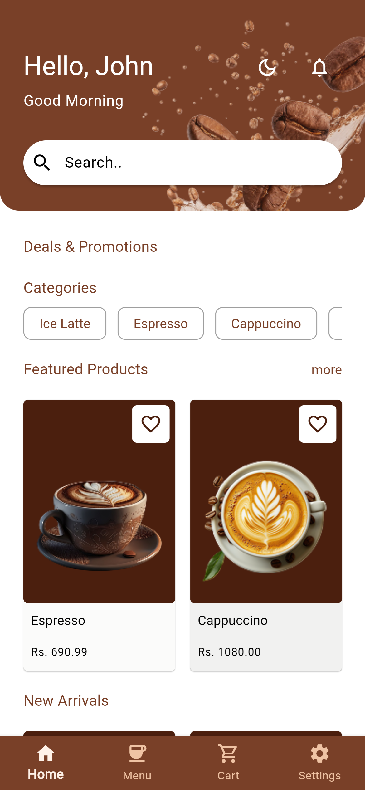
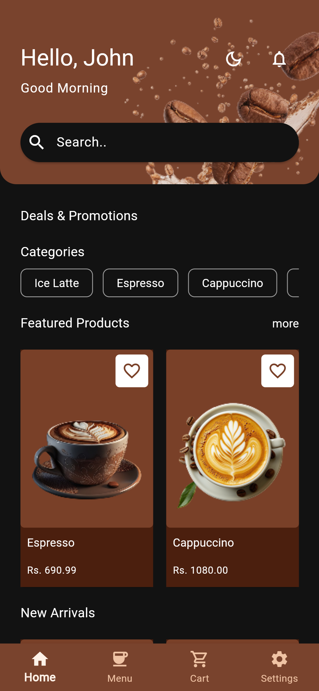

# ☕ Coffee App

A modern Flutter app for browsing and ordering coffee.

## 🚀 Features

* Browse a list of coffee products
* Add items to cart
* View total price

## 📱 Screens

* Home screen with featured coffees
* Product detail view
* Cart page with total and checkout button

## 🛠️ Tech Stack

* Flutter
* Dart
* Provider (for state management)

## ▶️ Getting Started

1. Clone the repo:

   ```bash
   git clone https://github.com/your-username/coffee_app.git
   ```
2. Install dependencies:

   ```bash
   flutter pub get
   ```
3. Run the app:

   ```bash
   flutter run
   ```

## 📸 Preview

<div align="center">
  
  
</div>
